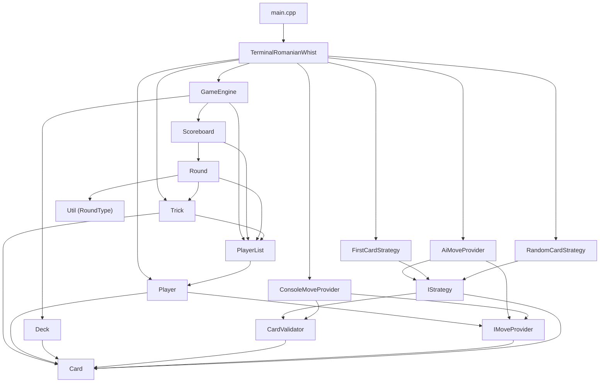

# Split Romanian Whist into Engine Library + Terminal UI Client

## Background

The project currently has all source files flat in one directory. The goal is to split into **two independent git repos**:

1. **`RomanianWhistEngine`** — a reusable header-only (or header + source) game engine library, like nlohmann/json
2. **`RomanianWhistTerminal`** — a terminal UI client that consumes the engine as a third-party library

## Current Dependency Graph

After reading every file, here's the full dependency tree:



## File Classification

| File | Belongs to | Rationale |
|------|-----------|-----------|
| `Card.h/cpp` | **Engine** | Core data type |
| `CardValidator.h/cpp` | **Engine** | Game rules (legal card validation) |
| `Deck.h/cpp` | **Engine** | Core game component |
| `Player.h/cpp` | **Engine** | Core game component |
| `PlayerList.h/cpp` | **Engine** | Core game component |
| `Trick.h/cpp` | **Engine** | Core game component |
| `Round.h/cpp` | **Engine** | Core game component |
| `Scoreboard.h/cpp` | **Engine** | Core game component |
| `GameEngine.h/cpp` | **Engine** | Main engine facade |
| `IMoveProvider.h` | **Engine** | Interface — the *extension point* for UI to inject behavior |
| `IStrategy.h` | **Engine** | Interface for AI strategies |
| `Util.h` | **Engine** | `RoundType` enum used by engine |
| `AiMoveProvider.h/cpp` | **Engine** | AI player logic — pure game logic, no I/O |
| `FirstCardStrategy.h/cpp` | **Engine** | AI strategy — pure game logic |
| `RandomCardStrategy.h/cpp` | **Engine** | AI strategy — pure game logic |
| `ConsoleMoveProvider.h/cpp` | **Terminal UI** | Uses `std::cin`/`std::cout` — UI-specific |
| `TerminalRomanianWhist.h/cpp` | **Terminal UI** | Game loop with terminal I/O |
| `main.cpp` | **Terminal UI** | Entry point |

> [!NOTE]
> The boundary is very clean. `ConsoleMoveProvider` is the **only** file that mixes I/O with game concepts. Everything else in the engine is pure logic. The `IMoveProvider` interface serves as the natural seam between engine and UI.

## Proposed Repo Structures

### Repo 1: `RomanianWhistEngine`

A standalone library. Consumers add it (e.g. as a git submodule, copy the `include/` and `src/` dirs, or use CMake `FetchContent`) and get access to all engine headers.

```
RomanianWhistEngine/
├── CMakeLists.txt              # builds the static library
├── README.md
├── include/
│   └── whist/                  # namespaced include dir
│       ├── Card.h
│       ├── CardValidator.h
│       ├── Deck.h
│       ├── Player.h
│       ├── PlayerList.h
│       ├── Trick.h
│       ├── Round.h
│       ├── Scoreboard.h
│       ├── GameEngine.h
│       ├── IMoveProvider.h
│       ├── IStrategy.h
│       ├── Util.h
│       ├── AiMoveProvider.h
│       ├── FirstCardStrategy.h
│       └── RandomCardStrategy.h
└── src/
    ├── Card.cpp
    ├── CardValidator.cpp
    ├── Deck.cpp
    ├── Player.cpp
    ├── PlayerList.cpp
    ├── Trick.cpp
    ├── Round.cpp
    ├── Scoreboard.cpp
    ├── GameEngine.cpp
    ├── AiMoveProvider.cpp
    ├── FirstCardStrategy.cpp
    └── RandomCardStrategy.cpp
```

**Key points:**
- All public headers go under `include/whist/` so consumers do `#include <whist/GameEngine.h>`
- The source files' internal `#include` directives change from `#include "Card.h"` → `#include <whist/Card.h>`
- CMake builds a static library target `whist_engine` and exports its include directory

---

### Repo 2: `RomanianWhistTerminal`

```
RomanianWhistTerminal/
├── CMakeLists.txt              # builds the executable, links whist_engine
├── README.md
├── libs/
│   └── RomanianWhistEngine/    # git submodule or copied library
├── src/
│   ├── main.cpp
│   ├── ConsoleMoveProvider.h
│   ├── ConsoleMoveProvider.cpp
│   ├── TerminalRomanianWhist.h
│   └── TerminalRomanianWhist.cpp
```

**Key points:**
- The engine is consumed via git submodule in `libs/` (or `FetchContent`, your choice)
- UI files include engine headers as `#include <whist/GameEngine.h>` etc.
- CMake `add_subdirectory(libs/RomanianWhistEngine)` and links against `whist_engine`

---

## Include Path Changes

All `#include "SomeFile.h"` directives in engine files change to `#include <whist/SomeFile.h>`. This gives the library a proper namespace so it doesn't collide with other headers when consumed by projects.

The terminal UI files also switch to `#include <whist/GameEngine.h>` etc. for engine headers, while keeping local `#include "ConsoleMoveProvider.h"` for their own files.

## CMakeLists.txt Sketches

### Engine `CMakeLists.txt`
```cmake
cmake_minimum_required(VERSION 3.14)
project(RomanianWhistEngine LANGUAGES CXX)

set(CMAKE_CXX_STANDARD 17)

add_library(whist_engine STATIC
    src/Card.cpp
    src/CardValidator.cpp
    src/Deck.cpp
    src/Player.cpp
    src/PlayerList.cpp
    src/Trick.cpp
    src/Round.cpp
    src/Scoreboard.cpp
    src/GameEngine.cpp
    src/AiMoveProvider.cpp
    src/FirstCardStrategy.cpp
    src/RandomCardStrategy.cpp
)

target_include_directories(whist_engine PUBLIC
    $<BUILD_INTERFACE:${CMAKE_CURRENT_SOURCE_DIR}/include>
    $<INSTALL_INTERFACE:include>
)
```

### Terminal `CMakeLists.txt`
```cmake
cmake_minimum_required(VERSION 3.14)
project(RomanianWhistTerminal LANGUAGES CXX)

set(CMAKE_CXX_STANDARD 17)

add_subdirectory(libs/RomanianWhistEngine)

add_executable(whist_terminal
    src/main.cpp
    src/ConsoleMoveProvider.cpp
    src/TerminalRomanianWhist.cpp
)

target_link_libraries(whist_terminal PRIVATE whist_engine)
```

## User Review Required

> [!IMPORTANT]
> **Header namespace**: I'm proposing `whist/` as the include namespace (so `#include <whist/GameEngine.h>`). If you'd prefer something else like `romanian_whist/` or just include files flat without a subdirectory, let me know.

Answer: I'd prefer romanian_whist.

> [!IMPORTANT]
> **Library consumption method**: The plan uses a **git submodule** (`libs/RomanianWhistEngine/`) as the primary integration method, since you mentioned wanting something like nlohmann/json where you "download the library and include it." Alternatives:
> - **CMake FetchContent** — automatically clones from GitHub at build time, no submodule needed
> - **Manual copy** — just copy the `include/` and `src/` folders into your project
>
> Which approach do you prefer?
Answer: git submodule is ok. but after you're done, I will need precisie instructions on how to use it. ideally this would be included in the repo's readme.

> [!IMPORTANT]
> **AI strategies placement**: I put `AiMoveProvider`, `FirstCardStrategy`, and `RandomCardStrategy` in the **engine** repo since they're pure game logic with zero I/O. This means any UI project that uses the engine gets built-in AI opponents for free. If you'd prefer them in the terminal repo (or in a third "AI" repo), let me know.
Answer: I agree. Keeping them in the engine repo is the correct choice. Just one mention, though: I'd like the strategies to be in a separate sub-folder (called strategies).

## Open Questions

1. **Where should the new repos live on disk?** Should I create them as sibling directories to the current project (e.g. `/home/dan/Projects/RomanianWhistEngine/` and `/home/dan/Projects/RomanianWhistTerminal/`)? Or somewhere else?
Answer:
The "engine" code will remain in this repo. I will rename it later from github.
As for the terminal code, I've created the romanian_whist_terminal repo and have added it to this project's scope. Let me know if you can see it.

2. **Git history**: Do you want to preserve git history for the files that move to each repo, or is a fresh `git init` for each new repo fine?
Answer:
As mentioned above, the engine code will remain in this repo and the history will be kept as is.
As for the terminal repo, the existing (terminal related) files/code will be added to the new repo and a new history will start from that point.

3. **Build system**: The plan uses CMake. Are you currently compiling manually with `g++`? Would you like me to set up CMake for both repos, or do you prefer a different build system (Makefile, etc.)?
Use CMake for both and then document this.

## Execution Plan

Once you approve, I'll:

1. Create the `RomanianWhistEngine` repo with the `include/whist/` + `src/` layout
2. Move and update all engine files (updating `#include` paths)
3. Write the engine's `CMakeLists.txt`
4. Create the `RomanianWhistTerminal` repo
5. Move and update UI files (updating `#include` paths)
6. Add the engine as a submodule (or copy, depending on your preference)
7. Write the terminal's `CMakeLists.txt`
8. Verify both projects build

## Verification Plan

### Automated Tests
- `cmake --build` both projects from scratch to verify they compile
- Run the terminal executable to confirm the game still works end-to-end

### Manual Verification
- Inspect that `#include` paths resolve correctly
- Confirm the engine can be consumed independently (build the engine library standalone)
